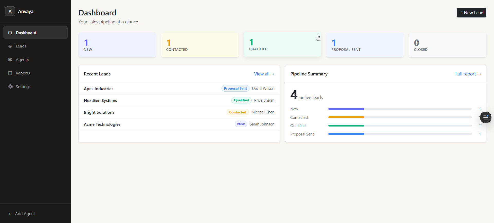
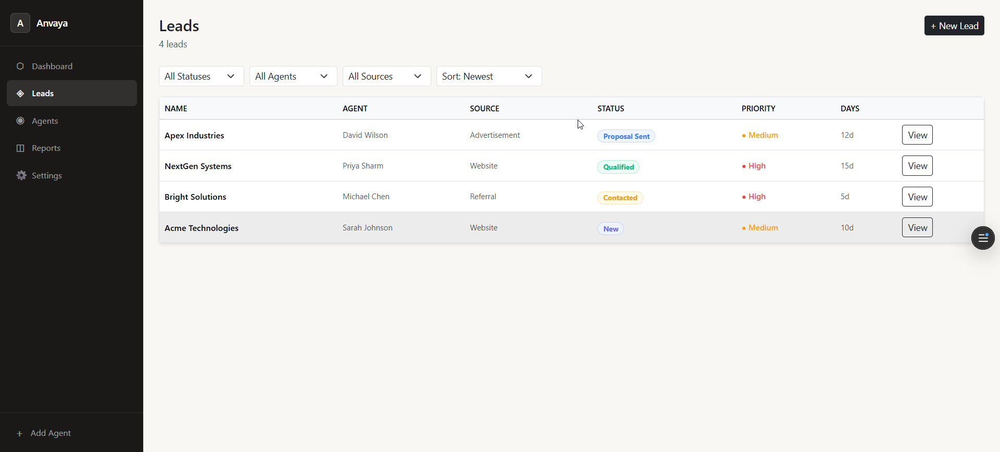
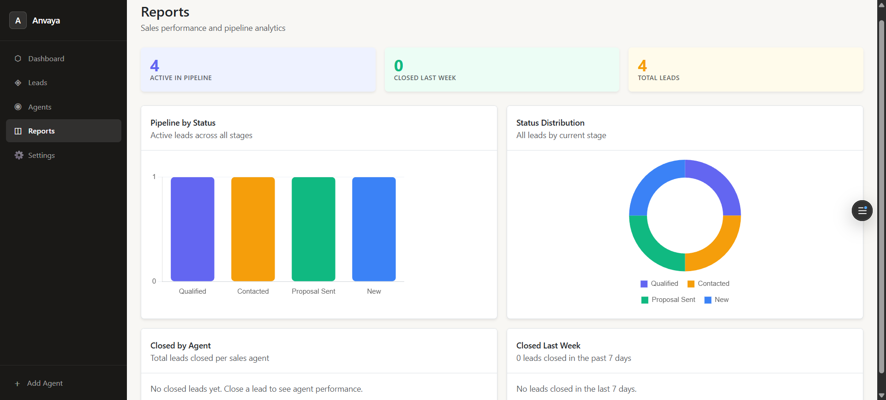
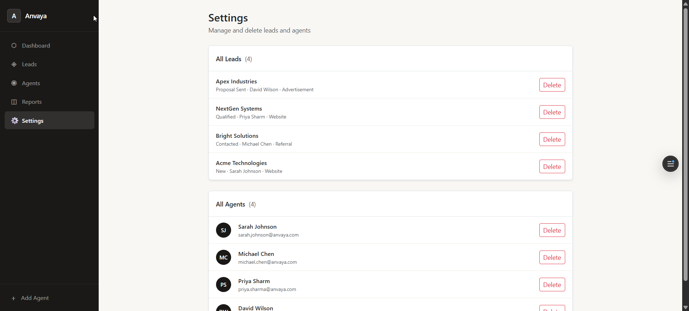

# Anvaya — Frontend

> A modern Sales CRM to track leads, manage agents, and monitor pipeline performance — built with React + Vite.



---

## 📌 Project Overview

Anvaya is a full-stack Sales CRM (Customer Relationship Manager) that helps sales teams:

- Track **leads** from first contact to closed deal
- Assign leads to **sales agents**
- Leave **comments** and activity notes on each lead
- Visualise performance through **reports and charts**
- Manage data via a clean **Settings** page

This repository contains the **frontend** — the React application users interact with in the browser.

---

## 🖥️ Screenshots

| Dashboard | Leads List |
|-----------|------------|
|  |  |

| Leads | Add new lead |
|--------------|---------|
|  |  |

| Lead Details | Reports |
|--------------|---------|
|  |  |

| Add new agent | Settings |
|--------------|---------|
|  |  |

---

## 🛠️ Tech Stack

| Technology | Purpose |
|------------|---------|
| [React 18](https://react.dev) | UI framework — component-based, reactive rendering |
| [Vite](https://vitejs.dev) | Build tool — lightning fast dev server and bundler |
| [React Router v6](https://reactrouter.com) | Client-side routing between pages |
| [Bootstrap 5](https://getbootstrap.com) | CSS utility classes and grid layout |
| [Chart.js](https://www.chartjs.org) | Bar and doughnut charts on the Reports page |
| [Vercel](https://vercel.com) | Hosting and deployment |

---

## 📁 Folder Structure

```
anvaya-frontend/
├── public/
│   └── favicon.svg
├── src/
│   ├── components/
│   │   └── Layout.jsx          # Sidebar + mobile nav wrapper
│   ├── pages/
│   │   ├── Dashboard.jsx       # Overview + stat cards + pipeline
│   │   ├── LeadList.jsx        # All leads with filters and sorting
│   │   ├── AddLead.jsx         # Form to create a new lead
│   │   ├── LeadDetails.jsx     # View, edit a lead + comments
│   │   ├── Agents.jsx          # Sales agent list + add form
│   │   ├── Reports.jsx         # Charts and analytics
│   │   └── Settings.jsx        # Delete leads and agents
│   ├── services/
│   │   └── api.js              # All API calls to the backend
│   ├── App.jsx                 # Router and route definitions
│   ├── main.jsx                # Entry point
│   └── index.css               # Global styles + responsive CSS
├── vercel.json                 # SPA routing fix for Vercel
├── vite.config.js
└── package.json
```

---

## ⚙️ Installation & Setup

### Prerequisites

- [Node.js](https://nodejs.org) v18 or above
- The Anvaya backend running locally or deployed

### Steps

**1. Clone the repository**

```bash
git clone https://github.com/abdulmukeeth/anvaya-frontend.git
cd anvaya-frontend
```

**2. Install dependencies**

```bash
npm install
```

**3. Configure the API URL**

Open `src/services/api.js` and set `BASE_URL` to your backend:

```js
// For local development
const BASE_URL = "http://localhost:3000";

// For production (your deployed backend URL)
const BASE_URL = "https://anvaya-backend-five.vercel.app/";
```

**4. Start the development server**

```bash
npm run dev
```

The app will open at `http://localhost:5173`

**5. Build for production**

```bash
npm run build
```

---

## 🚀 Deployment (Vercel)

1. Push your code to GitHub
2. Go to [vercel.com](https://vercel.com) → New Project → Import your repo
3. Vercel auto-detects Vite — no config needed
4. Set your `BASE_URL` in `src/services/api.js` to your deployed backend URL
5. Deploy — your frontend goes live instantly

> **Important:** The `vercel.json` file in the root ensures page refreshes work correctly on all routes.

---

## 🔗 Related

- [Anvaya Backend Repository](https://github.com/abdulmukeeth/anvaya-backend)
- [Live Demo](https://anvaya-seven.vercel.app/)

---

## 👤 Author

Built by **Abdul Mukeeth**